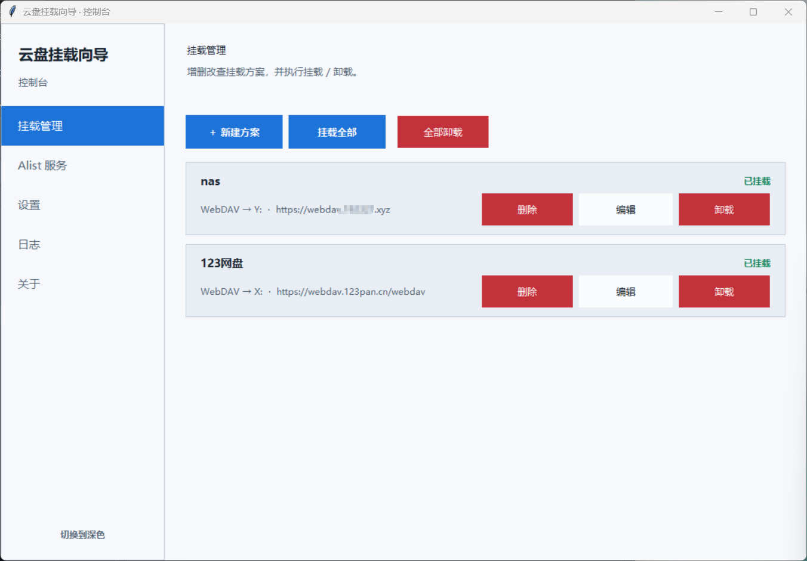

# WindowsMountTool

我做了一个面向 Windows 的云盘挂载工具，通过 Alist / OpenList、rclone 和 WinFsp，把 WebDAV 或其他支持的网盘服务挂载成 Windows 本地盘符。

当前版本主要面向 Windows x64，界面使用 Python + Tkinter 编写，提供深色和浅色主题。

## 功能

WindowsMountTool 由安装器和配置向导组成：

- 安装器负责安装程序，并提供 Alist、rclone 和 WinFsp 所需的发布资源。
- 配置向导支持 WebDAV 直连，也支持通过 Alist / OpenList 聚合多个网盘。
- 可以保存多个挂载方案，为每个方案设置远端地址、账号、密码、盘符和卷标。
- 支持挂载、卸载、状态检查、日志查看、健康检查和开机自启。
- 配置向导内置驱动状态检查、管理后台入口、主题切换和关于页面。




## 下载与运行

请前往 [GitHub Releases](https://github.com/cjm2004/WindowsMountTool/releases) 下载最新版本。目前提供 `v1.0.0` 正式版。

### 推荐方式：使用安装器

1. 下载 `CloudMountSetup.exe`。
2. 双击运行安装器，按提示选择安装目录和需要的组件。
3. 如果安装 WinFsp 后提示重启 Windows，请先重启，再继续使用软件。
4. 从开始菜单或安装目录启动“云盘挂载向导”。
5. 在向导中检查 Alist、rclone 和 WinFsp 状态。
6. 新建挂载方案：
   - 使用 WebDAV 直连时，填写 WebDAV 地址、账号和密码；
   - 使用 Alist / OpenList 时，先配置并启动 Alist，再填写对应连接信息。
7. 选择一个未被占用的盘符，保存方案后点击“挂载”。
8. 在 Windows 文件资源管理器中确认盘符已经出现，再开始使用。

卸载时，先在配置向导中卸载正在使用的盘符，再从 Windows“应用和功能”中卸载 WindowsMountTool。是否保留挂载配置和 Alist 数据，可根据需要选择。

### 独立运行

也可以直接下载并运行 Release 中的 `mount_wizard.exe`。这种方式适合已有运行环境或只需要启动配置向导的情况；首次使用仍需要准备 WinFsp、Alist 和 rclone。

## 项目结构

以下是 GitHub 源码仓库中实际公开的表层目录和文件：

```text
winmount/
├─ .gitignore
├─ LICENSE
├─ README.md
├─ ui_theme.py
├─ py_src/
├─ py_src_wizard/
└─ screenshots/
```

- `py_src/`：安装器和卸载器源码、PyInstaller 配置、安装器图标及第三方声明。
- `py_src_wizard/`：配置向导源码、PyInstaller 配置、图标、公开页面资源和 rclone 配置模板。
- `screenshots/`：README 中使用的界面截图。
- `ui_theme.py`：公共界面主题模块。
- `LICENSE`：本项目 MIT 许可证。
- `README.md`：项目说明和使用方法。

`docs/` 和 `tests/` 只保留在我的本地开发目录，不上传到 GitHub。运行环境、构建缓存、历史归档、日志和正式 EXE 也不放在源码仓库中。

## 从源码构建

构建环境：

- Windows 10/11 x64
- Python 3.12 或兼容版本，并包含 Tkinter
- PyInstaller
- WinFsp（用于真实挂载测试）

源码仓库不包含 Alist、rclone、WinFsp 安装包和已构建的 EXE。需要这些文件时，请从 [v1.0.0 Release](https://github.com/cjm2004/WindowsMountTool/releases/tag/v1.0.0) 获取对应附件，并按照 `.spec` 文件中的路径准备构建环境。

构建顺序：先构建配置向导，再把向导复制到安装器 payload，最后构建安装器。

```powershell
Set-Location py_src_wizard
python -m PyInstaller --noconfirm mount_wizard.spec
Copy-Item .\dist\mount_wizard.exe ..\py_src\payload\mount_wizard.exe -Force
Set-Location ..\py_src
python -m PyInstaller --noconfirm CloudMountSetup.spec
```

输出文件通常位于：

```text
py_src_wizard\dist\mount_wizard.exe
py_src\dist\CloudMountSetup.exe
```

## 安全提示

- 不要把真实密码、令牌、Cookie、个人 WebDAV 地址或运行日志上传到公开仓库。
- rclone 配置中的密码应先使用 `rclone obscure` 处理。
- WinFsp 安装后可能需要重启，挂载成功应以 Windows 文件资源管理器中出现真实盘符为准。
- Alist / OpenList、rclone 和 WinFsp 属于第三方组件，使用时请遵守各自许可证和服务条款。

## 许可证

本项目采用 [MIT License](LICENSE)。

发布版本包含 Alist、rclone、WinFsp 等第三方组件，它们仍受各自许可证约束。第三方组件声明见 Release 附件中的 `THIRD_PARTY_NOTICES.txt`。

## 反馈问题

如果遇到问题，请在 [Issues](https://github.com/cjm2004/WindowsMountTool/issues) 中说明 Windows 版本、软件版本、安装方式和复现步骤。提交日志或配置前，请先隐藏账号、密码、令牌、Cookie、私人地址和本机路径。
